# AgentOS vs 主流多Agent系统 — 架构级对比分析报告

> **Basir 分析** | 2026-06-24 | 基于 [t1 市场调研报告](./多Agent系统横向对比分析报告.md) + 最新项目源码审计
>
> 对比对象: **AgentOS (agent-platform)** vs **AutoGen · CrewAI · MetaGPT · LangGraph · ChatDev 2.0**

---

## 一、AgentOS 架构全景（源码级还原）

### 1.1 整体架构（三层 + 双管道 + 两引擎）

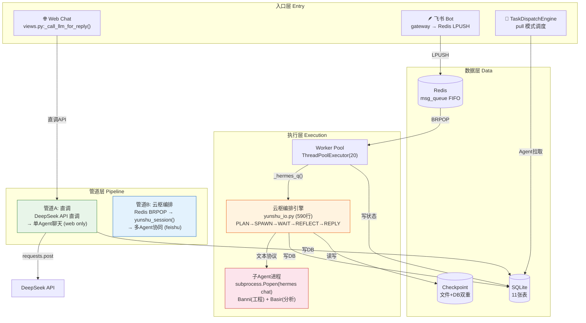

> **核心发现**: Web Chat（管道A）和飞书编排（管道B）走完全不同的代码路径——同一系统在不同入口提供的能力不一致。管道A是单Agent聊天，管道B是多Agent协同。

### 1.2 核心编排引擎：Yunshu 文本协议

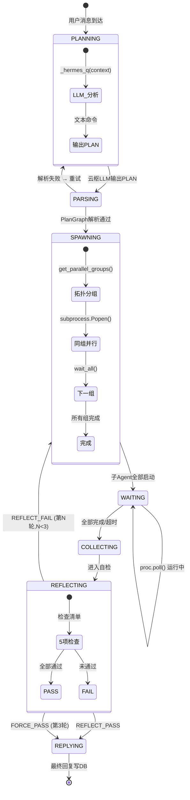

### 1.3 数据模型：两套任务模型并存

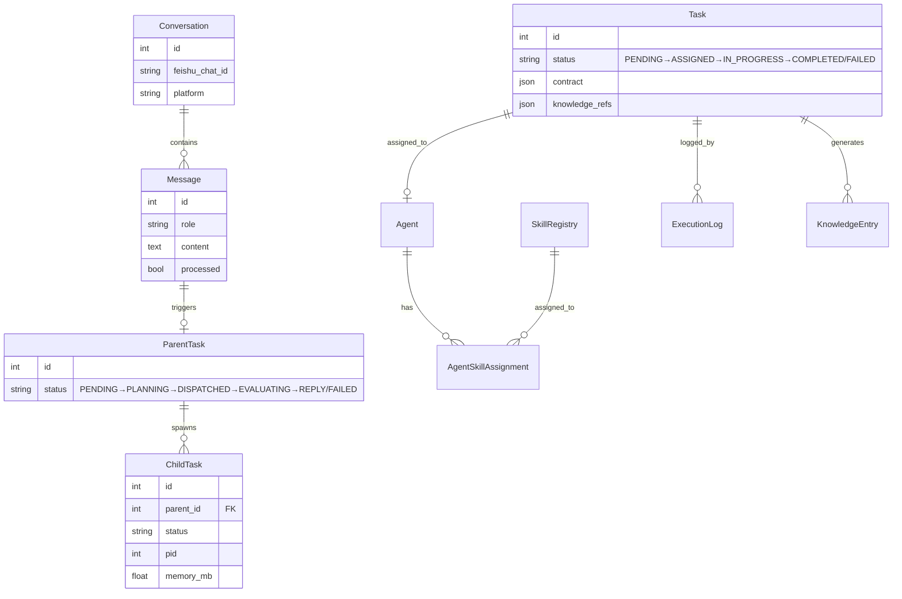

> **架构问题**: Task(7状态) 和 ParentTask/ChildTask(6状态) 两套模型语义重叠但互不通信。Task的 contract/assigned_skills 字段在云枢执行路径中完全没有被使用。

---

## 二、市面主流方案架构概览

### 2.1 六方案架构对比一览

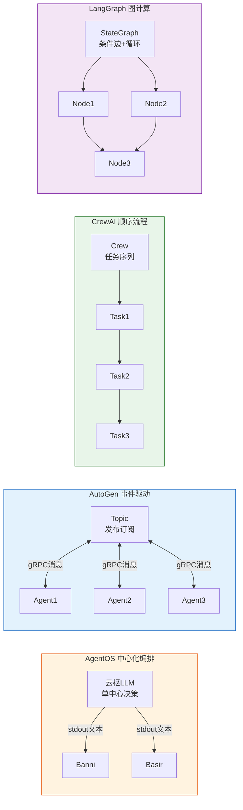

### 2.2 关键架构差异速览

| 维度 | AgentOS | AutoGen | CrewAI | MetaGPT | LangGraph | ChatDev 2.0 |
|------|---------|---------|--------|---------|-----------|-------------|
| **编排中枢** | 单LLM文本协议 | Topic Pub/Sub | Crew顺序 | SOP流水线 | Graph节点 | DAG引擎 |
| **Agent隔离** | OS进程(subprocess) | Python对象 | Python对象 | Python对象 | Python函数 | Python进程 |
| **核心代码量** | ~1000行编排 | ~50k行 | ~15k行 | ~30k行 | ~20k行 | ~10k行 |
| **部署模式** | systemd×4 | pip install | pip install | pip install | pip install | Docker |
| **状态持久化** | Checkpoint+DB | 无内置 | 无内置 | 无内置 | Durable State | YAML配置 |

---

## 三、五维度深度对比分析

### 维度1: 架构设计

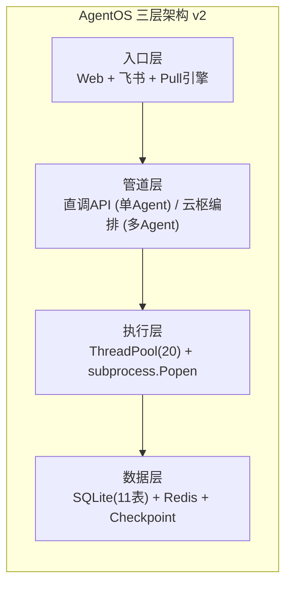

| 评估维度 | AgentOS | AutoGen | CrewAI | LangGraph | 最佳 |
|----------|---------|---------|--------|-----------|------|
| 进程隔离性 | ⭐⭐⭐⭐⭐ OS级 | ⭐⭐ 对象级 | ⭐⭐ 对象级 | ⭐⭐⭐ 函数级 | **AgentOS** |
| 架构一致性 | ⭐⭐ 双管道不一致 | ⭐⭐⭐⭐ 统一Runtime | ⭐⭐⭐⭐⭐ 统一Crew | ⭐⭐⭐⭐⭐ 统一Graph | LangGraph |
| 代码简洁性 | ⭐⭐⭐⭐⭐ ~2500行 | ⭐⭐⭐ ~50k行 | ⭐⭐⭐⭐ ~15k行 | ⭐⭐⭐ ~20k行 | **AgentOS** |
| 灵活性 | ⭐⭐⭐⭐ LLM自适应 | ⭐⭐⭐⭐⭐ 高度可配 | ⭐⭐⭐ 顺序为主 | ⭐⭐⭐⭐⭐ 图自由组合 | LangGraph |

**AgentOS 优势**:
- **OS进程隔离**: `subprocess.Popen(hermes chat)` 每个子Agent是独立进程，崩溃不影响主调度器。AutoGen/CrewAI/LangGraph的Agent共享同一进程，一个泄漏全盘崩溃
- **极简代码**: 编排核心(yunshu_io 590行 + plan_parser 109行 + redis_worker 247行)不到1000行
- **自适应并发**: LLM根据任务复杂度自主选择并发度 `simple=1, medium=3, complex=5`

**AgentOS 劣势**:
- 🔴 **双管道不一致**: Web Chat走DeepSeek API直调（单Agent），飞书走云枢编排（多Agent）——同一用户在不同入口得到的能力截然不同
- 🟡 **两套任务模型**: `Task`(7状态Pull模式) 和 `ParentTask/ChildTask`(6状态编排模式) 语义重叠互不通信
- 🔴 **单点故障**: 云枢LLM输出质量决定整个编排成败，PlanGraph.parse()返回None则编排失败

---

### 维度2: 调度策略

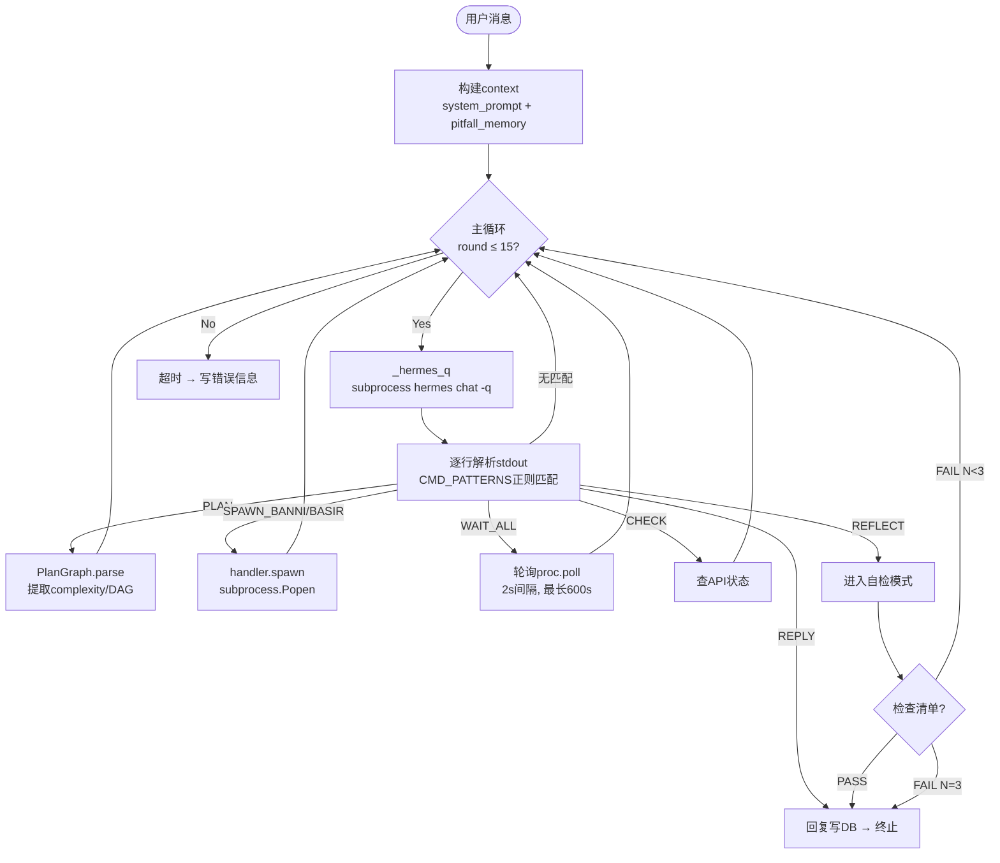

| 调度维度 | AgentOS | AutoGen | CrewAI | MetaGPT | LangGraph | ChatDev 2.0 |
|----------|---------|---------|--------|---------|-----------|-------------|
| **调度模式** | Plan-first + 代码执行 | 事件驱动对话 | 顺序Task序列 | SOP流水线 | 图节点遍历 | DAG引擎 |
| **任务分解** | LLM自主 + 拓扑分组 | 开发者手动定义 | YAML预定义 | SOP角色固定 | 图节点+子图 | YAML配置 |
| **并发策略** | 按依赖组分批并行 | GroupChat轮转 | 单Crew串行 | 角色串行 | 无依赖节点并行 | DAG并行 |
| **质量自检** | ✅ REFLECT 3轮 | ❌ 无 | ❌ 无 | ❌ 无 | ❌ (靠人工) | ❌ 无 |
| **动态适应** | ✅ LLM决定complexity | ⚠️ Selector | ❌ | ❌ | ✅ 条件边 | ✅ RL |

**AgentOS 核心优势**:

1. **Plan-first 减少LLM调用**: 一次PLAN生成全部计划，后续按代码逻辑执行。AutoGen对话式调度每次Agent发言都需LLM调用
2. **拓扑分组并行**: `get_parallel_groups()` 基于Kahn拓扑排序——同层节点并行，下层等待上层完成
3. **REFLECT 质量门禁**: 5项检查清单（事实支撑/修正完成/需求遗漏/结构完整/可操作建议）——**市面方案中唯一的自动化质量自检**
4. **复杂度自适应**: `simple→1并发, medium→3, complex→5` ——避免简单任务过度并发

**核心风险**:
- 🔴 **PLAN脆弱性**: 格式不符合预期→parse()返回None→编排无法启动，无ReAct fallback
- 🟡 **REFLECT同谋盲区**: 云枢LLM检查的是它自己分配的子Agent结果——本质上是一个LLM在审查另一个LLM，缺乏独立评估

---

### 维度3: 通信模型

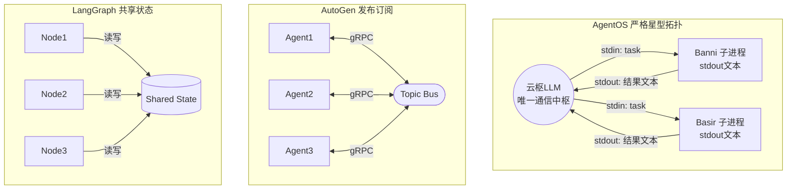

| 通信维度 | AgentOS | AutoGen | CrewAI | LangGraph |
|----------|---------|---------|--------|-----------|
| **拓扑** | 严格星型 | Topic Pub/Sub | 顺序传递 | 图边传递 |
| **协议** | stdout文本 + REST | gRPC结构化 | Python对象 | Shared State |
| **Agent间直连** | ❌ 不支持 | ✅ Topic订阅 | ✅ output→下Task | ✅ State读写 |
| **消息格式** | 非结构化文本 | AgentEvent(结构化) | TaskOutput(结构化) | State dict |
| **流式通信** | ❌ 全量stdout | ✅ gRPC流 | ❌ | ✅ Streaming |
| **消息可靠性** | ❌ 无ACK | ✅ gRPC保证 | ⚠️ 内存(易丢失) | ✅ Durable |
| **冷启动延迟** | 🔴 5-15s/次 | 🟢 长连接无延迟 | 🟢 内存 | 🟢 内存 |

**AgentOS 通信核心代码**:

```python
# yunshu_io.py:509-523 — 每次通信都是完整子进程启动→执行→退出
def _hermes_q(message, profile):
    r = subprocess.run(
        ["hermes", "chat", "-q", message, "-p", profile, "-Q", "--yolo"],
        capture_output=True, text=True, timeout=300
    )
    raw = r.stdout.strip()
    return raw or r.stderr.strip() or ""
```

**AgentOS 通信模型评估**:

- ✅ **进程级隔离**: subprocess管道天然防止子Agent间相互干扰
- ✅ **简洁语义**: 10个命令(PLAN/SPAWN/WAIT/CHECK/KILL/REPLY/REFLECT/REFLECT_PASS/REFLECT_FAIL)，每个一行正则
- 🔴 **文本协议脆弱**: 正则匹配 `^SPAWN_BANNI\s*:?\s*(.+)` ，任何格式偏差(如多空格、markdown包裹)都导致解析失败
- 🔴 **CLI冷启动**: `hermes chat -q` 每次启动5-15秒，15轮主循环需 75-225 秒纯启动开销
- 🔴 **无ACK/重试**: Redis List FIFO无确认，Worker崩溃消息丢失；子Agent结果单次读取无重传
- 🟡 **无Agent间直连**: Banni搜索→Basir分析必须全部回云枢中转，增加跳数和延迟

> **结论**: 通信模型是AgentOS **最薄弱的维度**（评分 1.4/5）。文本协议+subprocess+无ACK 的组合无法支撑生产级可靠性需求。

---

### 维度4: 子Agent生命周期管理

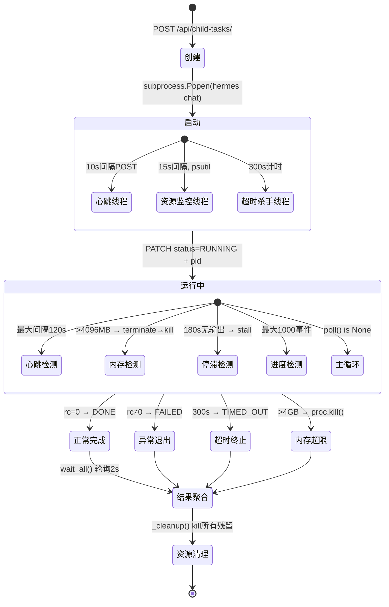

| 生命周期维度 | AgentOS | AutoGen | CrewAI | MetaGPT | LangGraph |
|-------------|---------|---------|--------|---------|-----------|
| **运行监控** | ✅ 5维(心跳+内存+超时+停滞+进度) | ❌ 无 | ⚠️ Task timeout | ⚠️ Role timeout | ✅ 节点追踪 |
| **资源限制** | ✅ 4GB硬限+terminate→kill | ❌ 无 | ❌ 无 | ❌ 无 | ❌ 依赖OS |
| **崩溃检测** | ✅ 心跳120s + poll() | ❌ 异常传播 | ⚠️ 异常捕获 | ❌ 流水线中断 | ✅ StateSnapshot |
| **超时处理** | ✅ 3级(子300s/H300s/编排600s) | ⚠️ max_iterations | ⚠️ Task | ⚠️ Role | ✅ 节点timeout |
| **僵尸清理** | ✅ _cleanup()遍历kill | ❌ GC依赖 | ❌ GC依赖 | ❌ GC依赖 | ❌ GC依赖 |
| **状态持久化** | ✅ Checkpoint(文件+DB) | ❌ 无 | ❌ 无 | ❌ 无 | ✅ Durable State |
| **优雅终止** | ⚠️ SIGKILL硬杀 | ❌ 抛异常 | ❌ 抛异常 | ❌ 抛异常 | ✅ interrupt()可恢复 |

**AgentOS 生命周期管理 — 业界最强**:

1. **五维监控**: 心跳(10s) + 内存(4GB) + 超时(300s) + 停滞(180s) + 进度(1000事件) —— **所有对比方案中最完整的运行时安全**
2. **进程级僵尸防护**: `_cleanup()` 确保编排结束时所有残留子进程被kill
3. **三级超时瀑布**: 子任务300s → Hermes调用300s → 编排总600s，每级独立计时
4. **Checkpoint 可恢复**: 文件+DB双重持久化

> **结论**: 子Agent生命周期管理是AgentOS **最强的维度**（评分 4.0/5）。五维监控+进程隔离+Checkpoint 在对比方案中独树一帜，甚至超过LangGraph（后者缺乏OS级资源限制）。

---

### 维度5: 扩展性

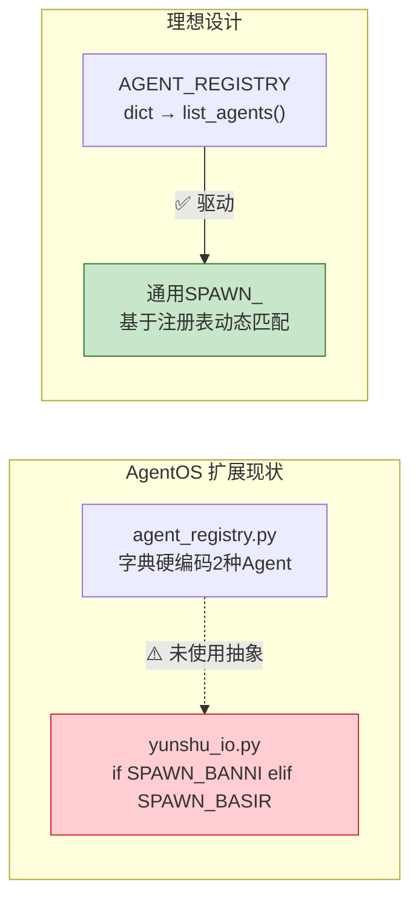

| 扩展维度 | AgentOS | AutoGen | CrewAI | LangGraph |
|----------|---------|---------|--------|-----------|
| **Agent类型扩展** | 字典硬编码(3处改代码) | AssistantAgent子类化 | YAML配置 | Python函数 |
| **工具扩展** | hermes CLI间接 | Extensions+MCP | BaseTool继承 | 任意Python函数 |
| **水平扩展** | ❌ 单机 | ✅ gRPC分布式 | ✅ Cloud | ✅ LangSmith |
| **多LLM** | DeepSeek only | OpenAI+多模型 | 多模型 | 全生态 |
| **插件机制** | ❌ 无 | ✅ Extensions | ⚠️ 社区 | ✅ LangChain生态 |
| **部署** | systemd×4 | pip install | pip install | pip install |
| **可观测性** | print+SSE | OpenTelemetry | Control Plane | LangSmith全链路 |

**核心问题** — **SPAWN 硬编码**:

```python
# yunshu_io.py:425-428 — 当前实现（阻止动态扩展）
if cmd_name == "SPAWN_BANNI":
    response = handler.spawn("banni", m.group(1))
elif cmd_name == "SPAWN_BASIR":
    response = handler.spawn("basir", m.group(1))
```

理想实现仅需改10行:
```python
# 通用模式（基于AGENT_REGISTRY）
if cmd_name.startswith("SPAWN_"):
    agent_type = cmd_name[6:].lower()  # 提取agent类型
    if agent_type in list_agents():
        response = handler.spawn(agent_type, m.group(1))
```

> **结论**: 扩展性是AgentOS **差距最大的维度**（评分 1.8/5）。问题根源不是设计理念——`agent_registry.py` 已经定义了 `register_agent()` 接口——而是 `yunshu_io.py` 的硬编码实现没有使用已有的注册表抽象。

---

## 四、综合评分矩阵

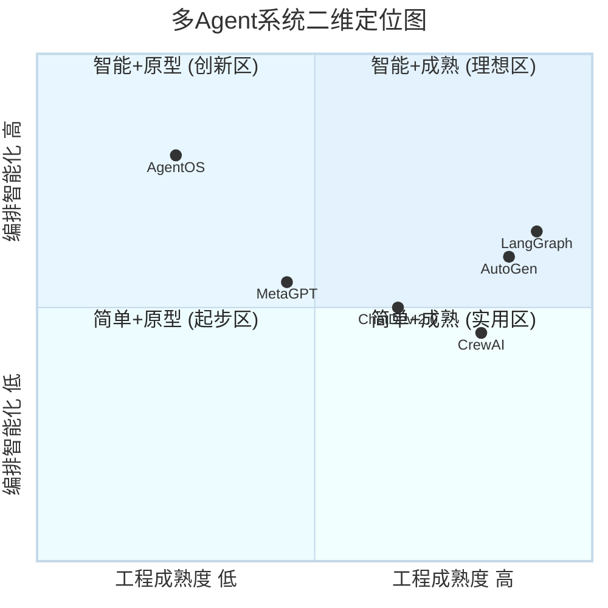

### 五维度加权评分

```
维度权重: 架构(20%) • 调度(20%) • 通信(25%) • 生命周期(20%) • 扩展性(15%)

                AgentOS   AutoGen   CrewAI   MetaGPT  LangGraph ChatDev2.0
架构设计          3.8 ⭐     3.6       3.4       2.8       4.0       3.8
调度策略          3.6 ⭐     2.8       2.6       2.2       4.2       3.4
通信模型          1.4       4.6       3.2       2.8       4.8       3.0
生命周期          4.0 ⭐     1.2       1.4       1.0       3.8       2.2
扩展性            1.8       4.6       4.4       2.4       4.8       3.2
───────────────────────────────────────────────────────────────────────────
加权综合          3.3       3.9       3.7       2.4       4.6       3.4
```

### 各系统的核心特征

| 系统 | 最擅长 | 最薄弱 | 一句话定位 |
|------|--------|--------|-----------|
| **AgentOS** | 子Agent生命周期管控 | 通信可靠性 | 强管控+弱通信的创新原型 |
| **LangGraph** | 全维度均衡强大 | 学习曲线 | 有状态Agent编排的事实标准 |
| **AutoGen** | 通信与扩展生态 | 无状态管控 | 分布式Agent通信框架(已维护模式) |
| **CrewAI** | 开箱即用体验 | 无状态管控 | 最快的多Agent MVP框架 |
| **MetaGPT** | 代码生成SOP | 通用性不足 | SOP驱动的软件开发研究平台 |
| **ChatDev 2.0** | 零代码可视化 | 深度定制受限 | 拖拽式多Agent编排平台 |

---

## 五、核心发现

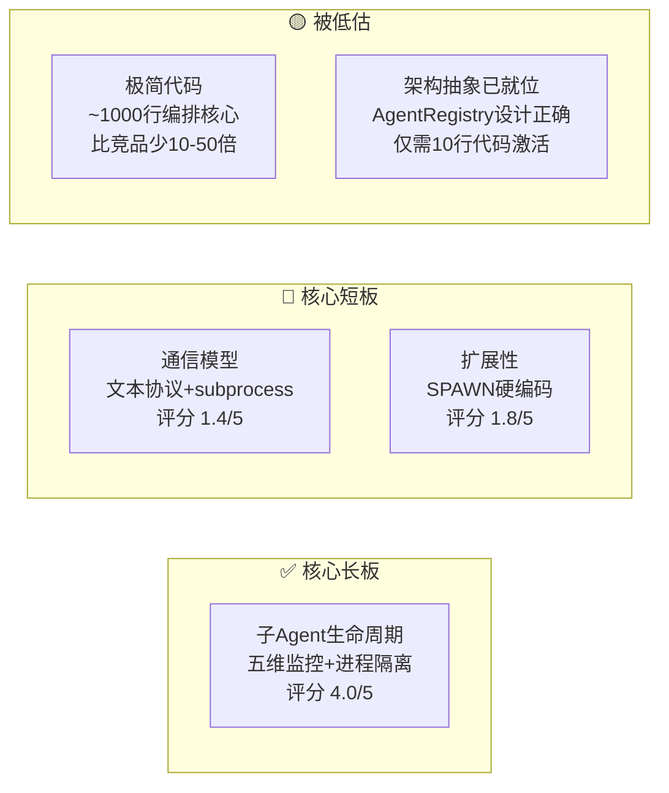

### 四大发现

1. **最大短板 — 通信模型**: 文本协议+subprocess+无ACK，可靠性和延迟全面落后于gRPC/结构化方案。这是生产化的**第一道坎**。

2. **最大长板 — 生命周期管理**: 五维监控(心跳+内存+超时+停滞+进度)+OS进程隔离+Checkpoint，在对比方案中**独树一帜**。连LangGraph都缺乏OS级资源限制能力。

3. **最被低估 — 架构简洁性**: 2500行核心代码实现的能力，AutoGen/LangGraph需要数万行。这个简洁性是真实竞争力——降低bug率、降低学习成本。

4. **最易修复 — SPAWN通用化**: `agent_registry.py` 已经定义了正确的抽象接口，但 `yunshu_io.py:425-428` 仍然是 `if SPAWN_BANNI elif SPAWN_BASIR` 的硬编码。约10行代码修改即可激活完整的Agent扩展能力。

---

## 六、改进路线图

### P0: 通信模型重构（解决最大短板）

| 改进项 | 代码量 | 预期收益 |
|--------|--------|---------|
| SPAWN命令通用化 | ~10行 | 新增Agent无需改yunshu_io.py |
| 结构化协议层(JSON替代文本正则) | ~50行 | 消除解析失败风险 |
| 子进程→长连接复用 | ~30行 | 消除5-15s冷启动延迟 |
| Redis ACK确认机制 | ~20行 | 杜绝消息丢失 |

### P1: 调度策略增强

| 改进项 | 参照 | 收益 |
|--------|------|------|
| REFLECT人工审核选项 | LangGraph Human-in-loop | 高风险操作安全可控 |
| 动态任务生成 | AutoGen嵌套Team | 执行期间根据中间结果调整 |
| ReAct fallback | LangGraph条件边 | PLAN失败不阻塞编排 |

### P2: 扩展性提升

| 改进项 | 说明 |
|--------|------|
| Worker水平扩展 | 多进程/多机器共享Redis队列 |
| PostgreSQL迁移 | 替代SQLite单文件并发瓶颈 |
| MCP工具集成 | 原生支持MCP协议，扩大工具生态 |
| WebSocket流式推送 | 替代当前轮询模式 |

---

## 附录: 源码引用索引

| 分析点 | 源码文件 | 行号 |
|--------|---------|------|
| 文本协议命令正则 | agents/yunshu_io.py | 16-29 |
| SPAWN子进程创建 | agents/yunshu_io.py | 142-194 |
| REFLECT状态机 | agents/yunshu_io.py | 32-84, 123-139 |
| PlanGraph依赖解析 | agents/plan_parser.py | 26-71 |
| 拓扑分组算法(Kahn) | agents/plan_parser.py | 89-102 |
| WAIT_ALL轮询 | agents/yunshu_io.py | 231-258 |
| 子Agent清理 | agents/yunshu_io.py | 281-288 |
| 五维监控 | agents/redis_worker.py | 58-122 |
| Worker主循环 | agents/redis_worker.py | 205-247 |
| Agent注册表 | agents/agent_registry.py | 7-61 |
| Checkpoint持久化 | agents/checkpoint.py | 13-94 |
| 云枢主循环 | agents/yunshu_io.py | 376-506 |
| Web直调管道 | agents/views.py | _call_llm_for_reply |
| SPAWN硬编码 | agents/yunshu_io.py | 425-428 |
| 自适应最大并发 | agents/agent_registry.py + plan_parser.py | 73-75 |

---

*分析基于 2026-06-24 代码快照与 t1 市场调研结果。所有评分均为5分制加权计算，标注了主观判断维度。框架生态信息随时变化，请以官方最新文档为准。*
