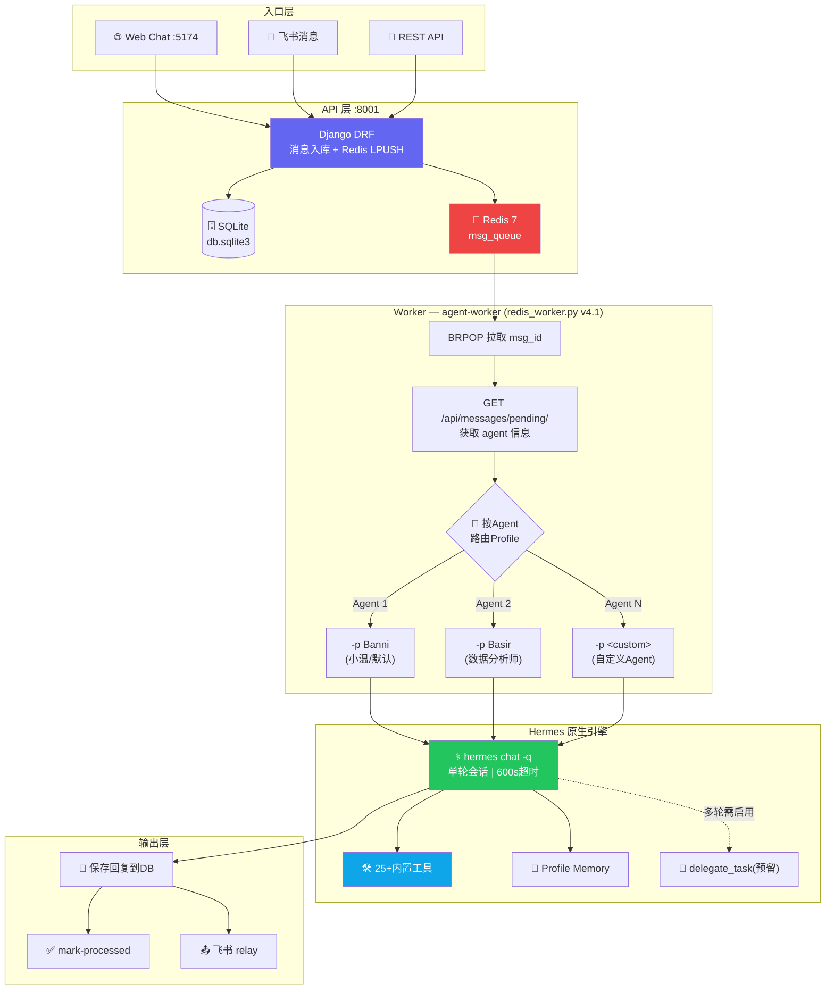

# Agent Platform 运行时架构

> 更新时间：2026-06-22 | LLM：DeepSeek v4-pro | Worker：v4.1 多Agent引擎

---

## 1. 核心流程



---

## 2. 运行中服务 (systemd --user)

| 服务 | systemd 名称 | 端口 | 文件 | 配置 |
|------|-------------|------|------|------|
| API 后端 | agent-backend | 8001 | `venv/bin/gunicorn agent_platform.wsgi:application` | `--workers 2 --timeout 120 --bind 0.0.0.0:8001` |
| Web 前端 | agent-frontend | 5174 | `npx vite preview` | `--host 0.0.0.0 --port 5174`，服务 `dist/` 静态文件 |
| 消息 Worker | agent-worker | — | `venv/bin/python agents/redis_worker.py` | Redis BRPOP 阻塞拉取，600s 超时 |
| 编排守护 | orch-daemon | — | `venv/bin/python3 orchestrator_daemon.py` | 每 30s 轮询 `pending` Task |

**服务重启**：
```bash
systemctl --user restart agent-backend    # Django 代码改动后
systemctl --user restart agent-frontend   # npm run build 后
systemctl --user restart agent-worker     # redis_worker.py 改动后
systemctl --user restart orch-daemon      # 编排逻辑改动后
```

**路径**：
- 后端项目：`~/projects/agent-platform/`
- 前端项目：`~/projects/agent-frontend/`
- 数据库：`~/projects/agent-platform/db.sqlite3`
- 前端构建产物：`~/projects/agent-frontend/dist/`

---

## 3. 消息处理全链路

### 3.1 入队阶段
```
用户消息 → POST /api/messages/ 
  → Django MessageViewSet.perform_create()
  → SQLite INSERT (processed=False, source=web|feishu)
  → redis.lpush("msg_queue", message.id)
```

### 3.2 Worker 拉取 (redis_worker.py v4.1)
```
redis.brpop("msg_queue", timeout=5) → (key, msg_id)
  → GET /api/messages/pending/ → 获取完整消息上下文：
    ├─ agent_id          — 会话关联的 Agent ID
    ├─ agent_name        — Agent 名称
    ├─ agent_portrait    — Agent 人设/角色定义
    ├─ agent_profile     — Hermes profile 名称 (Banni | Basir | ...)
    ├─ agent_model       — 模型选择 (deepseek-chat | deepseek-v4-pro)
    ├─ feishu_chat_id    — 飞书会话ID (跨平台回传用)
    ├─ source            — 来源 (web | feishu)
    └─ history[]         — 最近 20 条历史消息
  → POST system 消息 "✅ 已收到，开始处理..." (metadata.orch=received)
```

### 3.3 Hermes 引擎处理
```
hermes chat -q "<portrait注入消息>" -p <agent_profile>
  ├─ 加载 Profile 的 Memory (USER.md + MEMORY.md)
  ├─ 加载 Profile 的 Skills
  ├─ 可用工具 (25+):
  │   terminal | read_file | write_file | search_files | patch
  │   browser_navigate | browser_snapshot | browser_click
  │   web_search | web_extract | delegate_task
  │   skill_view | skill_manage | memory | cronjob
  │   feishu_doc_read | feishu_drive_add_comment
  │   vision_analyze | send_message | session_search
  └─ 返回最终回复 (stdout)
```

### 3.4 回复保存与回传
```
POST /api/messages/ → 保存 agent 回复 (processed=True, role=agent)
  → POST /api/messages/mark-processed/ → 批量标记用户消息
  → 如果 source="feishu" → relay_feishu.py 回传飞书
```

---

## 4. 多 Agent 路由机制

| Agent | ID | Hermes Profile | 模型 | 核心能力 |
|-------|-----|---------------|------|---------|
| 飞书助手小温 | 1 | Banni | deepseek-v4-pro | 通用助手，高效直接，中文优先 |
| 数据分析师 | 2 | Banni | deepseek-chat | 数据采集/清洗/分析/报告，自动化运维 |
| 豆角云枢 | 3 | Banni | deepseek-chat | 任务分解，Multi-Agent 协同调度 |

**路由原理**：
1. Conversation 创建时绑定 `agent_id`
2. Worker 拉取消息时 API 返回 `agent_profile = agent.config_public.profile`
3. Worker 调用 `hermes chat -q -p <agent_profile>` 
4. Portrait 通过消息前缀 XML 标签注入角色

**Persona 注入格式**：
```
<role_override>
从现在开始，严格按照以下身份定义进行回复...
{agent.portrait}
</role_override>

<user_query>
{user_message}
</user_query>
```

**已知限制**：Profile Memory 中的默认身份（"小温"）部分覆盖 portrait 注入。完全人格隔离需要为每个 Agent 建立独立的 Hermes profile。

**Agent 配置字段 (agents 表)**：
| 字段 | 类型 | 用途 |
|------|------|------|
| portrait | TEXT | 角色定义/人设/性格/能力 |
| config_public | JSON | 公开配置：model, provider, profile, port, feishu_app_id |
| config_encrypted | TEXT | AES加密敏感配置（API Key 等） |

---

## 5. API 端点全览

### 5.1 REST Router 端点 (DefaultRouter 自动注册)

| 方法 | 路径 | ViewSet | 说明 |
|------|------|---------|------|
| GET/POST | /api/agents/ | AgentViewSet | Agent 列表/注册 |
| GET/PUT/PATCH/DELETE | /api/agents/{id}/ | AgentViewSet | Agent 详情/更新/删除 |
| POST | /api/agents/register/ | @action | 新 Agent 注册 |
| POST | /api/agents/{id}/heartbeat/ | @action | Agent 心跳上报 |
| POST | /api/agents/{id}/assign-skill/ | @action | 分配技能给 Agent |
| POST | /api/agents/{id}/config/ | @action | 更新 Agent 配置 |
| POST | /api/agents/{id}/reveal-config/ | @action | 解密查看敏感配置 |
| POST | /api/agents/{id}/pull-tasks/ | @action | Agent 拉取待执行任务 |

| 方法 | 路径 | ViewSet | 说明 |
|------|------|---------|------|
| GET/POST | /api/skills/ | SkillViewSet | 技能库列表/注册 |
| GET/PUT/PATCH/DELETE | /api/skills/{id}/ | SkillViewSet | 技能详情/更新/删除 |

| 方法 | 路径 | ViewSet | 说明 |
|------|------|---------|------|
| GET/POST | /api/tasks/ | TaskViewSet | 任务列表/创建 |
| GET/PUT/PATCH/DELETE | /api/tasks/{id}/ | TaskViewSet | 任务详情/更新/删除 |
| POST | /api/tasks/{id}/status/ | @action | 更新任务状态 |
| POST | /api/tasks/{id}/logs/ | @action (POST) | 添加执行日志 |
| GET | /api/tasks/{id}/logs/ | @action (GET) | 查询任务日志 |
| POST | /api/tasks/{id}/cancel/ | @action | 取消任务 |
| POST | /api/tasks/batch-cancel/ | @action | 批量取消任务 |
| POST | /api/tasks/batch-delete/ | @action | 批量删除任务 |

| 方法 | 路径 | ViewSet | 说明 |
|------|------|---------|------|
| GET/POST | /api/conversations/ | ConversationViewSet | 会话列表/创建 |
| GET/DELETE | /api/conversations/{id}/ | ConversationViewSet | 会话详情(含消息)/删除 |
| GET | /api/conversations/{id}/orchestration-progress/ | @action | 编排进度 |
| GET | /api/conversations/{id}/orch-state/ | @action | 编排状态(idle/running/paused) |
| POST | /api/conversations/{id}/stop/ | @action | 停止编排 |
| POST | /api/conversations/{id}/pause/ | @action | 暂停编排 |

| 方法 | 路径 | ViewSet | 说明 |
|------|------|---------|------|
| GET/POST | /api/messages/ | MessageViewSet | 消息列表/发送 |
| GET | /api/messages/pending/ | @action | **Worker 拉取待处理消息** |
| POST | /api/messages/mark-processed/ | @action | Worker 标记已处理 |

| 方法 | 路径 | ViewSet | 说明 |
|------|------|---------|------|
| GET/POST | /api/knowledge/ | KnowledgeEntryViewSet | 知识库条目 CRUD |
| GET/POST | /api/capabilities/ | CapabilityTagViewSet | 能力标签 CRUD |
| GET | /api/cron-jobs/ | CronJobViewSet | 定时任务列表 |
| GET | /api/cron-executions/ | CronExecutionViewSet | 执行日志列表 |

### 5.2 独立端点

| 方法 | 路径 | 函数 | 说明 |
|------|------|------|------|
| GET | /api/system/workers/ | system_workers | 返回 Worker 状态和在线数 |
| GET | /api/events/ | sse.event_stream | Server-Sent Events 推送 |

---

## 6. 数据库完整 Schema

### 6.1 agents — Agent 注册表 (3 rows)
```
id              INTEGER PK
name            VARCHAR(128)    NOT NULL    Agent 名称
portrait        TEXT            NOT NULL    角色定义/人设
feishu_app_id   VARCHAR(128)    NOT NULL    飞书应用ID
webhook_url     VARCHAR(512)    NOT NULL    Webhook 地址
status          VARCHAR(16)     NOT NULL    online|offline|idle
last_heartbeat  DATETIME                   最后心跳时间
version         VARCHAR(32)     NOT NULL    版本号
metadata        TEXT            NOT NULL    JSON 扩展元数据
config_public   TEXT            NOT NULL    JSON 公开配置(profile/model/provider)
config_encrypted TEXT           NOT NULL    AES 加密敏感配置
created_at      DATETIME        NOT NULL
updated_at      DATETIME        NOT NULL
```

### 6.2 conversations — 会话表 (3 rows)
```
id              INTEGER PK
title           VARCHAR(256)    NOT NULL    会话标题
agent_id        BIGINT          FK→agents  关联 Agent
feishu_chat_id  VARCHAR(128)               飞书会话ID (跨平台)
created_at      DATETIME        NOT NULL
```

### 6.3 messages — 消息表 (170 rows)
```
id              INTEGER PK
conversation_id BIGINT          NOT NULL FK→conversations
role            VARCHAR(16)     NOT NULL    user|agent|system
content         TEXT            NOT NULL    消息内容
source          VARCHAR(16)     NOT NULL    web|feishu
processed       BOOL            NOT NULL    是否已处理 (Worker标记)
metadata        TEXT            NOT NULL    JSON (orch event, html 等)
task_id         BIGINT          FK→tasks   关联任务
created_at      DATETIME        NOT NULL
```

### 6.4 tasks — 任务表 (77 rows)
```
id              INTEGER PK
title           VARCHAR(256)    NOT NULL    任务标题
description     TEXT            NOT NULL    任务描述
status          VARCHAR(16)     NOT NULL    pending|assigned|in_progress|running|completed|failed|cancelled
priority        VARCHAR(16)     NOT NULL    high|medium|low
contract        TEXT            NOT NULL    JSON 任务合同/输出规格
context         TEXT            NOT NULL    JSON 上下文/前置条件
knowledge_refs  TEXT            NOT NULL    JSON 知识引用
result          TEXT            NOT NULL    执行结果
agent_id        BIGINT          FK→agents  执行 Agent
source          VARCHAR(16)     NOT NULL    任务来源
parent_task_id  BIGINT          FK→tasks   父任务 (子任务拆分)
started_at      DATETIME                   开始执行时间
completed_at    DATETIME                   完成时间
deadline        DATETIME                   截止时间
created_at      DATETIME        NOT NULL
updated_at      DATETIME        NOT NULL
```

### 6.5 skill_registry — 技能注册表 (182 rows)
```
id              INTEGER PK
name            VARCHAR(128)    NOT NULL    技能名称
slug            VARCHAR(128)    NOT NULL    唯一标识
version         VARCHAR(32)     NOT NULL    版本号
description     TEXT            NOT NULL    描述
content         TEXT            NOT NULL    SKILL.md 内容
category        VARCHAR(64)     NOT NULL    分类
tags            TEXT            NOT NULL    JSON 标签数组
source          VARCHAR(16)     NOT NULL    local|meyo|hermes
status          VARCHAR(16)     NOT NULL    active|inactive|deprecated
file_url        VARCHAR(512)    NOT NULL    文件URL
file_hash       VARCHAR(64)     NOT NULL    文件哈希
file_size       INTEGER         NOT NULL    文件大小(字节)
meyo_skill_id   VARCHAR(64)                觅游社区技能ID
last_synced_at  DATETIME                   最后同步时间
created_at      DATETIME        NOT NULL
updated_at      DATETIME        NOT NULL
```

### 6.6 knowledge_entries — 知识库 (8 rows)
```
id              INTEGER PK
title           VARCHAR(256)    NOT NULL
content         TEXT            NOT NULL
entry_type      VARCHAR(32)     NOT NULL    条目类型
tags            TEXT            NOT NULL    JSON 标签
visibility      VARCHAR(16)     NOT NULL    可见性
relevance_score REAL            NOT NULL    相关性分数
view_count      INTEGER         NOT NULL    查看次数
useful_count    INTEGER         NOT NULL    有用次数
source_agent_id BIGINT          FK→agents  来源Agent
source_task_id  BIGINT          FK→tasks   来源任务
created_at      DATETIME        NOT NULL
updated_at      DATETIME        NOT NULL
```

### 6.7 其他表
| 表 | 行数 | 用途 |
|----|------|------|
| cron_jobs | 6 | 定时任务定义 (job_id, schedule, skill, enabled) |
| cron_executions | 4 | 定时任务执行日志 (status, result, duration) |
| execution_logs | 220 | 任务执行详细日志 (level, message, quality_gate) |
| capability_tags | 6 | 能力标签 (web-scraping, auto-ops, feishu-messaging 等) |
| agent_skill_assignments | 228 | Agent ↔ Skill 多对多关联 |
| agents_capabilities | 6 | Agent ↔ Capability 多对多关联 |

### 6.8 数据模型 ER 图
```
Agent 1──N Conversation
Agent 1──N Task
Agent M──N Skill (via agent_skill_assignments)
Agent M──N CapabilityTag (via agents_capabilities)
Conversation 1──N Message
Task 1──N ExecutionLog
Task 1──N SubTask (parent_task_id 自引用)
CronJob 1──N CronExecution
KnowledgeEntry M──N Skill (knowledge_entries_related_skills)
```

---

## 7. 前端架构 (React SPA)

### 7.1 路由
```
/chat           → ChatPage (全屏对话，浅色主题)
/*              → App (暗色Sci-Fi主题，侧边栏+内容区)
```

### 7.2 12 个视图

| 视图 | key | 组件 | 功能 |
|------|-----|------|------|
| 仪表盘 | dashboard | Dashboard.jsx | 6 指标卡片 + 任务列表 + 活动日志 |
| Agent管理 | agents | Agents.jsx | Agent 卡片网格，在线/离线状态 |
| 任务管理 | tasks | Tasks.jsx | 表格 + 搜索 + 批量管理 + Modal详情 |
| Skill库 | skills | Skills.jsx | 分类筛选 + 技能卡片 |
| 记忆管理 | memory | Memory.jsx | 知识条目列表 + 统计 |
| 会话中心 | sessions | Sessions.jsx | 浅色对话面板，实时轮询 |
| Tokens | tokens | Tokens.jsx | Token 使用统计 |
| Worker | workers | Workers.jsx | Worker 在线状态 |
| 定时任务 | cron | CronJobs.jsx | CronJob CRUD + 日志 |
| 运行日志 | logs | Logs.jsx | 终端风格执行日志 |
| 系统设置 | settings | Settings.jsx | 系统配置 |
| 全屏对话 | — | ChatPage.jsx | 独立全屏，浅色飞书风格 |

### 7.3 侧边栏
- 220px 暗色科幻风，可折叠至 72px
- 折叠后图标下方显示英文标签 (DASH/AGENT/TASK/SKILL...)
- 显示 Worker 在线数和系统时间

---

## 8. Redis 数据结构

| Key | 类型 | 用途 |
|-----|------|------|
| `msg_queue` | List | 消息队列，Django LPUSH，Worker BRPOP |
| `orch:*` | 各类 | 编排信号(暂停/停止/状态) |

---

## 9. LLM 配置

| 配置项 | 值 |
|--------|-----|
| Provider | DeepSeek |
| API Endpoint | `https://api.deepseek.com/v1/chat/completions` |
| 默认模型 | deepseek-chat |
| Agent 1 模型 | deepseek-v4-pro |
| API Key 存储 | `~/.hermes/profiles/Banni/.env` → `DEEPSEEK_API_KEY` |
| 超时 | 600s (单轮) |
| 温度 | 0.7 |
| Max Tokens | 2000 |

---

## 10. 目录结构

```
~/projects/
├── agent-platform/              # Django 后端
│   ├── manage.py
│   ├── db.sqlite3               # SQLite 数据库
│   ├── agent_platform/          # Django 项目配置
│   │   ├── settings.py
│   │   ├── urls.py
│   │   └── wsgi.py
│   ├── agents/                  # 核心应用
│   │   ├── models.py            # 15 个模型
│   │   ├── views.py             # 10 个 ViewSet + 独立视图
│   │   ├── serializers.py       # DRF 序列化器
│   │   ├── urls.py              # REST Router
│   │   ├── redis_worker.py      # Worker v4.1 (运行中)
│   │   ├── worker.py            # 旧 Worker v2 (直接调 DeepSeek)
│   │   ├── orchestrator.py      # 编排引擎
│   │   ├── orchestrator_daemon.py  # 编排守护进程
│   │   └── migrations/          # 13 个迁移文件
│   └── venv/                    # Python 虚拟环境
│
└── agent-frontend/              # React 前端
    ├── package.json
    ├── vite.config.js
    ├── dist/                    # 构建产物 (Vite preview 服务)
    └── src/
        ├── main.jsx             # 入口 + React Router
        ├── App.jsx              # 主布局 (侧边栏+内容区)
        ├── api.js               # API 客户端封装
        ├── index.css            # 全局样式 (437行自定义CSS)
        └── components/
            ├── Sidebar.jsx      # 侧边栏导航
            ├── Topbar.jsx       # 顶栏
            ├── Modal.jsx        # 6种弹窗 (Agent/任务/Skill/记忆/会话)
            ├── DetailPanel.jsx  # 侧边详情面板
            ├── Toast.jsx        # 消息提示
            └── views/
                ├── Dashboard.jsx   # 仪表盘
                ├── Agents.jsx      # Agent 管理
                ├── Tasks.jsx       # 任务管理
                ├── Skills.jsx      # Skill 库
                ├── Memory.jsx      # 记忆管理
                ├── Sessions.jsx    # 会话中心 (浅色)
                ├── ChatPage.jsx    # 全屏对话 (浅色)
                ├── Workers.jsx     # Worker 状态
                ├── CronJobs.jsx    # 定时任务
                ├── Tokens.jsx      # Token 统计
                ├── Logs.jsx        # 运行日志
                └── Settings.jsx    # 系统设置
```

---

## 11. 已知问题与限制

| 问题 | 影响 | 状态 |
|------|------|------|
| Agent persona 被 profile Memory 覆盖 | 非默认 Agent 回复仍带"小温"前缀 | 需独立 Hermes profile 以完全隔离 |
| 多 Agent 协同仅单轮分解 | 豆角云枢只能生成计划，无法真正 delegate | 需多轮会话+启用 delegate_task |
| 前端 Tailwind 类名缺失 | ChatPage 历史布局失效 | ✅ 已修复（全部改为自定义 CSS） |
| Agent 2 豆包 API 欠费 | Basir profile 返回 403 | ✅ 已改为 Banni profile |
| 新建会话未传递 agents prop | Modal 崩溃 (agents.map undefined) | ✅ 已修复 |
| `hermes chat` 不支持 `--system` | Portrait 注入依赖消息前缀 | 长期需支持或独立 profile |
